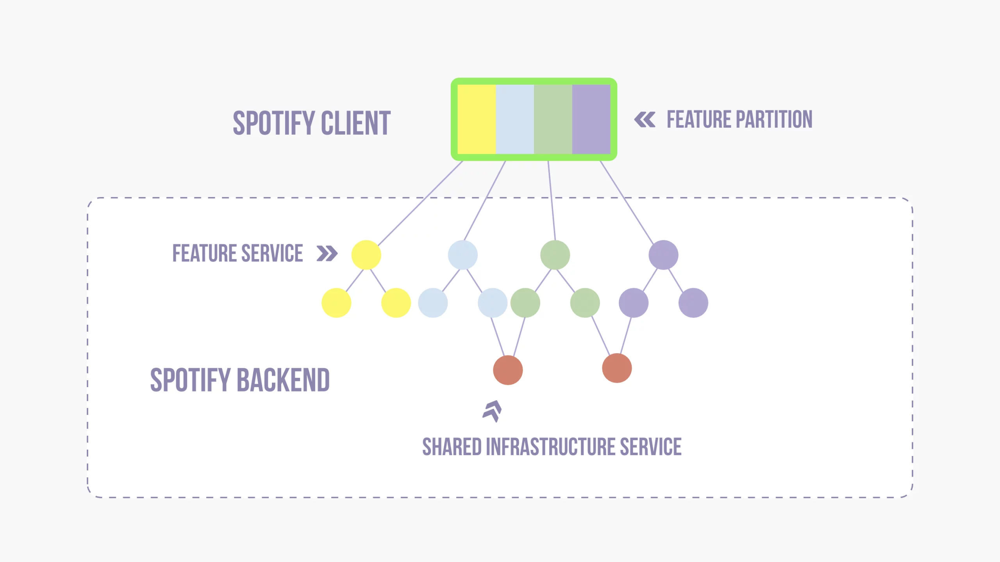

# Arquitetura de Sistemas de Software Populares - Spotify

### Engenharia de Software - PUC Minas

## Integrantes 👩🏻‍💻

- **Integrante 1**: [Arthur Jansen Oliveira](https://github.com/artjansentec)
- **Integrante 2**: [Bárbara Mattioly Andrade](https://github.com/barbaraMattioly)
- **Integrante 3**: [⁠Bruno Pontes Duarte](https://github.com/brunopdt)
- **Integrante 4**: [Laura Enísia Rodrigues Melo](https://github.com/lauramelo28)
- **Integrante 5**: [Samuel Marques Sousa Leal](https://github.com/SamLeal)

## Profesora 👨‍🏫
- [Aline Norberta de Brito](https://github.com/alinebrito)

# Sumário
- [Introdução](#introdução)
- [Funcionalidades e Segurança](#funcionalidades-e-segurança)
- [Arquitetura Organizacional](#arquitetura-organizacional)
- [Tecnologias Utilizadas](#tecnologias-utilizadas)
- [Descrição da Arquitetura](#descrição-da-arquitetura)
- [Curiosidades](#curiosidades)
- [Conclusão](#conclusão)
- [Referências Bibliográficas](#referências-bibliográficas)

## Introdução

O Spotify é o serviço de assinatura de streaming de áudio mais popular do mundo com cerca de 615 milhões de usuários, incluindo 239 milhões de assinantes. Foi lançado em 2008 para revolucionar a forma de ouvir músicas e segundo dados oficiais do próprio Spotify, conta hoje com mais de 100 milhões de faixas de músicas, 6 milhões de podcasts, 350.000 audiolivros e mais de 2 bilhões de playlists.

É um serviço digital que dá acesso instantâneo a esses milhões de músicas, podcasts, vídeos e outros conteúdos de criadores no mundo todo. Sua principal funcionalidade de reprodução de músicas é gratuita, conta com anúncios ao longo das músicas, mas permite aos usuários consumirem esse conteúdo sem a necessidade de serem assinantes. O serviço premium do Spotify (Spotify Premium) permite que os usuários desfrutem de todo o conteúdo de áudio sem interrupção e limitações.

O Spotify foi desenvolvido de forma a trazer uma experiência única para cada usuário, coletando os dados de uso de cada um e dessa forma trazendo recomendações com base nos gostos pessoais, montando coleções de músicas e podcasts voltadas a esses gostos.

É um serviço que possui compatibilidade com vários dispositivos, incluindo computadores, celulares, alto-falantes, televisões, carros e sistemas operacionais, como Android e IOS.

Para dar suporte a todos esses usuários, serviços de áudio e funcionalidades ele possui uma infraestrutura bem consolidada, além de contar com recursos de segurança para lidar com os dados sensíveis de cada usuário, como alguns dados pessoais e dados bancários.

## Requisitos e Funcionalidades

### **Funcionalidades**

- **Streaming de Música e Podcasts:** A principal funcionalidade do Spotify é o streaming de música. Os usuários podem pesquisar e reproduzir milhões de músicas de diferentes gêneros, artistas e álbuns.

- **Playlists Personalizadas:** O Spotify permite a criação de playlists personalizadas. Além disso, o algoritmo do Spotify também cria playlists baseadas nas preferências musicais do usuário.

- **Modo Offline:** Os usuários Premium podem baixar músicas para ouvir offline.

- **Integração com Redes Sociais:** Os usuários podem compartilhar suas músicas favoritas, playlists ou álbuns nas redes sociais. Também é possível ver o que os amigos estão ouvindo.

- **Rádio:** O Spotify tem uma funcionalidade de rádio que permite aos usuários ouvir estações baseadas em artistas, gêneros ou décadas.

### **Requisitos Técnicos**

- **Escalabilidade:** Devido ao grande número de usuários, o Spotify precisa ser altamente escalável. Para isso, eles usam uma combinação de bancos de dados NoSQL e SQL, permitindo que o sistema lide com grandes volumes de dados e tráfego.

- **Disponibilidade:** O Spotify precisa estar disponível 24/7 para seus usuários em todo o mundo. Eles utilizam a nuvem AWS (Amazon Web Services) para garantir alta disponibilidade e redundância.

- **Segurança:** Para proteger os dados dos usuários, o Spotify implementa várias medidas de segurança, incluindo criptografia, autenticação e controles de privacidade.

### **Requisitos de Segurança**

## Arquitetura Organizacional

O spotify é uma plataforma que está em constante crescimento, número de usuários diários, de serviços de áudio no catalogo, número de nós no backend que alimentam o serviço, número de plataforma de hardware em que seus clientes operam, número de aplicativos externos que hospedam na plataforma e o número de equipes de desenvolvimento que atuam nos produtos.

Para lidar com todo esse crescimento e garantir a velocidade de entega de novas funcionalidades, correções e ajustes, a arquitetura organizacional do spotiify é pensada de forma a eliminar ao máximo possível as dependências entre equipes e remover a complexidade na arquitetura do sistema.

As equipes (também chamadas de Squads) no Spotify são equipes autônomas que conseguem fazer entregas e se mover independentemente de outras squads, permitindo assim a realização de entregas constantes.

Todo o código do Spotify está disponível para todos os desenvolvedores de forma transparente, ou seja o código no cliente Spotify, no backend do Spotify e na infraestrutura do Spotify está disponível para todos os desenvolvedores do Spotify para lerem ou modificarem.

## Tecnologias Utilizadas

As principais linguagens utilizadas pelo Spotify são: Python, Java, JavaScript e C++. A linguagem Java é utilizada com o foco para o serviços de backend devido à sua robustez e escalabilidade. O Python é utilizado principalmente na área de machine learning, data analysis e em alguns componentes do backend. Dessa forma, aliado à esses recursos, a inteligência artificial atua na recomendação de músicas, playlists e podcasts para os usuários. Por fim, o C++ é usado para componentes de alto desempenho como codecs de áudio.

Para a comunicação, integração e monitoramento da arquitetura distribuída em microsserviços implementada pela aplicação, também são utilizadas outras ferramentas como *kubernetes* (para a orquestração de conteineres, permitindo a implantação e gestão de aplicações em escala), *docker* (para conteinerização de aplicações, facilitando a portabilidade e consistência entre diferentes ambientes), *apache kafka* (para o processamento de fluxo de dados em tempo real, facilitando na comunicação entre diferentes serviços) e o *elasticsearch* para pesquisa e análise de dados em tempo real.

É válido ressaltar também que o Spotify é compatível com uma grande diversidade de sistemas operacionais e plataformas, de modo que usuários utilizem os serviços disponibilizados pela plataforma de qualquer dispositivo que tenham acesso: desde celulares e tablets, até televisões inteligentes e assistentes de voz integradas com a plataforma. O sistema apresenta suporte para os sistemas operacionais iOS, Android, Windows, macOS e Linux, tornando o sistema acessível para uma ampla gama de usuários.

## Descrição da Arquitetura

Todas as equipes compartilham uma mesma codebase, onde cada repositório git tem um proprietário de sistema dedicado que cuida do código e garante sua qualidade. Ademais, o modelo de código transparente que o Spotify proporciona garante que todos tenham acesso ao código de todos, garantindo uma padronização de código e avanço a todo momento.

Como é demonstrado no diagrama acima, cada serviço implementa sua própria lógica e, portanto, quando surge a necessidade de uma nova feature, apenas determinados componentes relacionados à funcionalidade idealizada devem ser modificados, testados e publicados, evitando o re-deploy na aplicação inteira. Dessa maneira, é possível extender a aplicação de maneira rápida e eficiente, garantindo uma melhor experiência para desenvolvedores e clientes finais.

## Modelagem Arquitetônica

O modelo C4 é uma abordagem leve e direta para visualizar a arquitetura de software. Além de esboçar algumas abstrações, o C4 define uma notação padrão e melhores práticas para desenhar diagramas de sistemas de software. No geral, ele fornece boas diretrizes para garantir que os diagramas de software sejam compreensíveis e possam ficar sozinhos sem contexto adicional. O C4 consegue um bom equilíbrio entre "caixas e flechas" ad hoc e padrões excessivamente formais, encaixando-se como uma luva às necessidades da empresa.

O C4 vem com uma coleção de abstrações de software. Então a duvida era a seguinte, como aplicá-lo ao lado das próprias abstrações do Modelo de Sistema do Spotify? O objetivo não era reinventar a roda, então mantiveram a notação C4 e as melhores práticas e substituíram sua camada de abstração pelo Modelo do Sistema da companhia. Consequentemente, tiveram que redefinir o conjunto de diagramas principais para documentar a arquitetura e o design do sistema:

- **Diagrama de paisagem do sistema:** Descreve um conjunto de sistemas relacionados, como eles estão conectados e de quais sistemas externos eles dependem — por exemplo, todos os sistemas de propriedade de um esquadrão ou todos os sistemas em um domínio
- **Diagrama de contexto do sistema:** descreve como um sistema se encaixa no contexto maior de dependências, dependentes e usuários
- **Diagrama de componentes do sistema:** Descreve como um sistema é construído a partir de componentes individuais (conhecido como diagrama de contêiner em C4. 

4)

Além disso, o Spotify utiliza o Backstage, um sistema de catalogo de software que possui uma serie de plug-ins extensível de arquitetura que oferece como grande benefício automatizar diagramas arquitetônicos fazendo com que eles sempre estejam atualizados com o design intencional expresso em metadados; Não haverá necessidade de atualizá-los à medida que o sistema evolui, e não haverá questionamento se a visualização está desatualizada.

## Curiosidades

Uma curiosidade é que para a comunicação interna dos microsserviços, existe um  protocolo diferente utilizado no contexto do Spotify: o Hermes. Ele foi desenvolvido tendo o ZeroMQ como base (assim como HTTP - TCP), e os URIs dos tópicos para o modelo pub/sub são denotados por hm.

## Conclusão

## Referências Bibliográficas

* [Decoding Software Architecture Of Spotify: How Microservices Empowers Spotify](https://www.techaheadcorp.com/blog/decoding-software-architecture-of-spotify-how-microservices-empowers-spotify/)
* [Backend infrastructure at Spotify](https://engineering.atspotify.com/2013/03/backend-infrastructure-at-spotify/)
* [O que é o Spotify?](https://support.spotify.com/br-pt/article/what-is-spotify/)
* [Spotify anuncia recurso que utiliza inteligência artificial para recomendar músicas; entenda](https://www.cnnbrasil.com.br/economia/spotify-anuncia-recurso-que-utiliza-inteligencia-artificial-para-recomendar-musicas-entenda/)
* [Como o Spotify usa Ciência de Dados para engajar usuários](https://medium.com/somos-tera/como-o-spotify-usa-ci%C3%AAncia-de-dados-para-engajar-usu%C3%A1rios-bc47e3b948af) 
* [Spotify e o poder das métricas](https://pt.k21.global/blog/spotify-e-o-poder-das-metricas?gad_source=1&gclid=Cj0KCQjwgJyyBhCGARIsAK8LVLOYm8cQUeFpoAwgkFN4N8EsCFLIyGEd3-2KqkI8sxpfrQBVitHXCI4aAnfIEALw_wcB )
* [The Hidden Pub/Sub of Spotify](https://www.distributed-systems.net/my-data/papers/2013.debs.pdf)
* [The Spotify System Model](https://engineering.atspotify.com/2022/07/software-visualization-challenge-accepted/)
